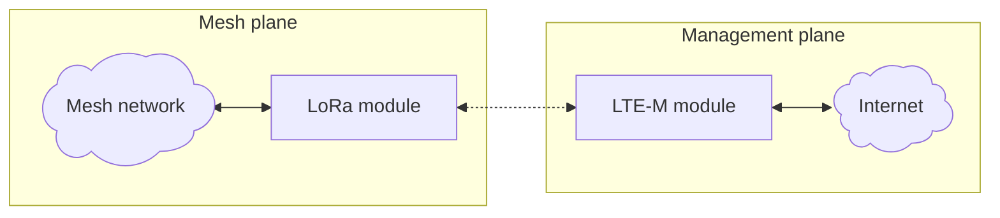

# TwinOak Standard Repeater Design v2

## General design concept and project goals
The thought behind this project came to life when i had quite a few failures in OTA firmware updates. I needed a better, and more stable, way of doing the firmware updates. 
Besides the devices being bricked from the OTA process, i also had a very long distance to drive to the repeaters, so i wanted something that could update remotely, from the comfort of my desk. 
I shortly considered using LoRa for sending the updates to the repeaters, but since the network is already congested enough, i didn't want to pile even more load on that band, assuming that i somehow get a stable link to all the repeater sites.

I decided on going for a design which incorporated an LTE-M module for managinge the node. This gives me almost 100% coverage(in Denmark at least!) and high bandwidth for firmware transfer. 
So the structure looked something like this:

Besides the problematic management of remote nodes, i also wanted to solve a few other issues with this new repeater design. So the primary goals for the project ended up begin:
1. <b>Remote management</b>. Being able to do management remotely based on existing LTE infrastructure. Only management, no data via LTE.
2. <b>Superior noise "rejection"</b> with radio in RF shielding and using proper cables and isolation to give the LoRa the best possible noise floor. I've previously used SenseCAP Solar P1 nodes, and even though they are very nice nodes, they are plastic enclosures with no RF protection. Put them next to a cell tower and you are in trouble! A bit ironic that my biggest nemesis regarding noise is LTE, when i'm going to use LTE as the transport for the management plane!
3. <b>Integrated cavity filter</b>. I've had to many issues with noise in all my locations. There is always a cell tower(or some DAB/DVT/whatever tower) sitting just next to great locations. The Solar P1 only offers the option to add a small SAW filter, but i want it to be easy to add a good cavity filter.
4. <b>Modularity</b>. Things change fast; firmware, features and other software changes fast! But hardware also changes. With the Solar P1 i had to replace the entire unit if i wanted to change a radio to something newer or better. I need something where i can change JUST the radio or JUST the solarpanel or JUST the batteries. Not doing a complete "forklift upgrade" everytime is a must.

## Bill-of-materials and links to sources

| Component            | Brand      | Model                             | Source                                                                                                   | Price     |
|----------------------|------------|-----------------------------------|----------------------------------------------------------------------------------------------------------|----------:|
| <u>*External components*</u>                                                                                                                                                                 |
| Antenna, LoRa        | Vinnant    | CC868/8-PEL 10dBi                 | [Hoeg teknik](https://hoegteknik.dk/shop/da/dv-nodermeshtastic/483-8dbd-58-antenne-for-868-mhz.html)     |   599 DKK |
| Antenna, LTE-M       |            | IP67, N-Male, "9dBi"              | [Aliexpress](https://www.aliexpress.com/item/1005005889564983.html)                                      |   ~50 DKK |
| Cable                | Bevotop    | LMR240, N Male to N Male, 80cm    | [Aliexpress](https://www.aliexpress.com/item/1005002640557645.html)                                      |   ~70 DKK |
| Pipe                 |            | 1" pipe, 200cm                    | [Webshop](https://shop.erik-larsen.dk/products/pipe-galv?variant=39625182412883)                         |   150 DKK |
| Brackets             |            | Pipeclamps, set of 2, max 60mm    | [Amazon](https://www.amazon.de/-/da/Premium-mastklemme-dobbeltklemme-galvaniseret-dobbelt/dp/B010UL5B66) |   ~67 DKK |
| Enclosure            |            | Diecast alu box, IP67             | [Aliexpress](https://www.aliexpress.com/item/1005007492347455.html)                                      |  ~185 DKK |
| Solar panel          |            | "30W" Solar Panel                 | [Aliexpress](https://www.aliexpress.com/item/1005009053070915.html)                                      |  ~200 DKK |
| Vent valve           |            | M16 watertight alu vent valve     | [Aliexpress](https://www.aliexpress.com/item/1005012242062756.html)                                      |   ~20 DKK |
| Bracket              |            | For solar panel                   | TBD                                                                                                      |           |
| Bracket              |            | For enclosure                     | TBD                                                                                                      |           |
| <u>*Internal components*</u>                                                                                                                                                                 |
| Backplates           | Custom     | Set of 2pce, 1,5mm lasercut alu   | (Fusion link? DXF?)                                                                                      |   280 DKK |
| RF boxes             | Gainta     | G103-IP67, 64x98x34mm, alu, 2pce  | [TME](https://www.tme.eu/dk/en/details/g103-ip67/multipurpose-enclosures/gainta/)                        |   108 DKK |
| Cavity filter        | Sysmocom   | 7Mhz Cavity filter(Link to test?) | [Sysmocom](https://shop.sysmocom.de/868-863..870-MHz-cavity-filter-ISM-LoRa-SigFox-Helium/cf866.5-kt30)  |  ~400 DKK |
| Battery              | Meshnology | 10.000mA LiPo battery             | [Meshnology](https://meshnology.com/collections/frontpage/products/3-7v-10000mah-lipo-battery-with-usb-charger-protection-for-arduino-esp32-drone?variant=46431266963694) | ~150 DKK |
| Cable                |            | U.FL -> SMA pigtail, 10cm         | [Aliexpress](https://www.aliexpress.com/item/1005009937311685.html)                                      |   ~10 DKK |
| Cable                |            | N-female -> SMA pigtail, 10cm     | [Aliexpress](https://www.aliexpress.com/item/1005008984322302.html)                                      |   ~10 DKK |
| Cable                |            | N-female -> SMA pigtail, 20cm     | [Aliexpress](https://www.aliexpress.com/item/1005008984322302.html)                                      |   ~10 DKK |
| Cable                |            | SMA -> SMA pigtail, 10cm          | [Aliexpress](https://www.aliexpress.com/item/1005006890065800.html)                                      |   ~10 DKK |
| <u>*Radio modules*</u>                                                                                                                                                                       |
| LoRa module          | Heltec     | Heltec V3, ESP32 based            | [Heltec](https://heltec.org/project/wifi-lora-32-v3/)                                                   |  ~120 DKK |
| *...or...*                                                                                                                                                                                   |
| LoRa module          | Heltec     | Heltec T096, nRF52 based          | [Heltec](https://heltec.org/project/t096/)                                                              |  ~230 DKK |
| LTE module           | Quickspot  | Walter LTE MCU, ESP32 based       | [TinyTronics](https://www.tinytronics.nl/nl/development-boards/microcontroller-boards/met-telecommunicatie/walter-esp32-s3-iot-development-board-cat-m-nb-iot-en-gnss-gm02sp) |   ~510 DKK |
| <u>*Custom PCBs*</u>                                                                                                                                                                         |
| Platform board       |            | TBD                               |                                                                                                          |           |
| Heltec V3 adapter    |            | TBD                               |                                                                                                          |           |
| *...or...*                                                                                                                                                                                   |
| Heltec T096 adapter  |            | TBD                               |                                                                                                          |           |
| LoRa connector board |            | TBD                               |                                                                                                          |           |
| LTE connector board  |            | TBD                               |                                                                                                          |           |
| <u>*Electrical components*</u>                                                                                                                                                               |
| D-sub connector      | Amphenol   | FCE17-E09SM-250, 9-pin, filter, x2| [Mouser](https://eu.mouser.com/en/ProductDetail/Amphenol-Commercial-Products/FCE17-E09SM-250)            |  ~175 DKK |
| D-sub connector      | Amphenol   | L717DFE09PT, 9-pin, male PCB, x2  | [Mouser](https://eu.mouser.com/en/ProductDetail/Amphenol-Commercial-Products/L717DFE09PT)                |  ~100 DKK |
| Capacitor            | Panasonic  | 16SEPG470M, 470µF PolyAlu, x1     | [TME](https://www.tme.eu/dk/en/details/16sepg470m/tht-polymer-capacitors/panasonic/)                     |   ~10 DKK |
| Capacitor            | AISHI      | EWH1CM101E11OT, 100µF, x2         | [TME](https://www.tme.eu/dk/en/details/ce-100_16pht-y/tht-electrolytic-capacitors/aishi/ewh1cm101e11ot/) |    ~1 DKK |
| Capacitor            | SR passives| CCT-10N/100V-S, 10nF Ceramic, x2  | [TME](https://www.tme.eu/dk/en/details/cct-10n_100v-s/mlcc-tht-capacitors/sr-passives/ct40805b103k101f1r/) |  ~1 DKK |                                                                                                        |           |
| Connector            |            | Pin headers for radio modules?    | TBD                                                                                                      |           |
| Connector            |            | Low profile headers for adapters? | TBD                                                                                                      |           |

Total: ~3.250DKK + TBD + solder/heatshrink/screws/wires/etc + shipping/customs/fees/etc

## LTE-M providers

### Lebara
I've tried a Lebara SIM card, their cheapest plan, and it worked fine with the Walter MCU and could get contact with the internet without issues.

### NexCon
I tried nexcon.io as a LTE provider, they have a 25MB/month plan that is VERY cheap, like 1eur/month per SIM card including a management website that is VERY nice! Can highly recommend them, however i think they only serve commercial customers, but i'm unsure of that.